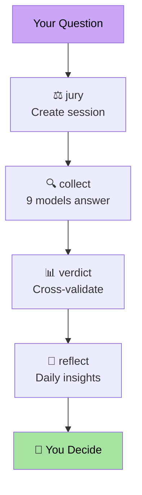

<p align="center">
  
  
  
  
  
  
</p>

<h1 align="center">AI Judge</h1>
<p align="center"><strong>9 AI models deliberate. You hold the gavel.</strong></p>

---

## What is AI Judge?

AI Judge is a **human-centric multi-model deliberation system**. It turns one question into a structured jury session — 9 frontier AI models answer independently, their claims are cross-validated across 5 dimensions, and you receive an auditable verdict. **The final decision is always yours.**

Think of it as a Supreme Court for AI outputs, where every model is a juror, every claim is evidence, and no AI gets to make the final call.

```
Your Question
    │
    ├──→ Gemini    (Google)       ─┐
    ├──→ ChatGPT   (OpenAI)       ─┤
    ├──→ DeepSeek  (DeepSeek)     ─┤
    ├──→ Qwen      (Alibaba)      ─┤
    ├──→ Kimi      (Moonshot AI)  ─┤ 9 independent answers
    ├──→ Grok      (xAI)          ─┤ via Chrome CDP +
    ├──→ Yuanbao   (Tencent)      ─┤ Swift desktop bridges
    ├──→ MiMo      (Xiaomi)       ─┤
    └──→ Doubao    (ByteDance)    ─┘
                    │
                    ▼
         ┌─────────────────────┐
         │  Cross-Validation    │
         │  · Claim scoring     │
         │  · Consensus detect  │
         │  · Audit trail       │
         └──────────┬──────────┘
                    │
                    ▼
            ┌───────────────┐
            │  Your Verdict  │  ← Human holds final gavel
            └───────────────┘
```

---

## Why AI Judge?

### The Single-Model Problem

One AI, one answer, one set of biases. You can't cross-examine a monologue.

### The Multi-Model Trap

Most multi-model systems let another AI pick the "best" answer. You've just moved the trust problem up one level.

### The AI Judge Difference

**Nine independent answers → cross-validated claims → auditable verdict → your decision.**

No black boxes. No "trust me." Every conclusion traces back to which model said what, with what evidence, at what confidence.

---

## Quick Start (5 minutes)

```bash
# 1. Install
pip install ai-judge

# 2. Activate license (Community = free for evaluation)
ai-judge license activate --key AJ-XXXX-XXXX-XXXX

# 3. Ask your question
ai-judge jury --question "Should we redesign our pricing page?"

# 4. Collect from all 9 seats
ai-judge collect --run latest

# 5. Generate verdict
ai-judge verdict --run latest

# 6. You decide.
```

```bash
# Docker alternative
docker compose up
docker compose run --rm ai-judge jury --question "..."
```

---

## The Council — 9 Seats

| Seat | Provider | Known For |
|------|----------|-----------|
| **Gemini** | Google | Broad knowledge, multi-modal |
| **ChatGPT** | OpenAI | Deep analysis, structured reasoning |
| **DeepSeek** | DeepSeek | Long-context, mathematical rigor |
| **Qwen** | Alibaba | Balanced, multilingual |
| **Kimi** | Moonshot AI | 200k+ context, Chinese depth |
| **Grok** | xAI | Truth-seeking, bold hypotheses |
| **Yuanbao** | Tencent | Logical coherence, constraint-aware |
| **MiMo** | Xiaomi | Concise, efficient |
| **Doubao** | ByteDance | Structured decomposition, thorough |

---

## What You Get

Every jury run produces a complete audit package:

```
~/.ai-judge/runs/2026-05-11-001/
├── task-status.json       # Session metadata
├── answers.md             # All 9 raw answers
├── claim-ledger.json      # Claim-by-claim breakdown
├── verdict.md             # Final verdict with evidence
├── feature-ledger.json    # Seat performance trends
└── audit-trail.json       # Complete traceability
```

---

## AI Judge vs llm-council

| | AI Judge | llm-council |
|---|---|---|
| **Final Authority** | Human | Chairman LLM |
| **Privacy** | Local-first (browser sessions) | OpenRouter API |
| **Models** | 9 (desktop + web) | 4 (configurable) |
| **Scoring** | 5-dimension claim-level | Anonymous ranking |
| **Audit Trail** | Full traceability chain | Conversation JSON |
| **Production** | Docker + CI/CD + key mgmt | Not supported |
| **License** | BSL 1.1 → MIT (4 years) | MIT |

[Full comparison →](docs/COMPARISON.md)

---

## Privacy — Local-First by Architecture

AI Judge connects through your **existing browser sessions**, not API keys.

| | AI Judge | API-Based Tools |
|---|---|---|
| Data leaves your machine? | No (browser session only) | Yes (all providers) |
| Third-party API gateway? | No | Yes (OpenRouter, etc.) |
| Separate API keys needed? | No | Yes (per provider) |
| PII/compliance risk? | Minimal | High |

---

## Pricing (Open-Core BSL)

| Plan | Price | Use Case |
|------|-------|----------|
| **Community** | Free | Evaluation & development |
| **Personal** | $49 one-time | Independent professionals |
| **Team** | $199 one-time | Teams with shared decisions |
| **Enterprise** | Custom | Regulated industries, SSO, SLA |

[Get a License →](https://ai-judge.dev)

---

## Open-Core Boundary

```
┌─────────────────────────────────────────────┐
│  THIS REPOSITORY (Public, BSL 1.1)           │
│  ✅ CLI surface      ✅ Swift bridges         │
│  ✅ Documentation    ✅ Docker packaging      │
│  ✅ Prompt templates ✅ Schema contracts      │
│  ✅ Hermes output    ✅ GitHub CI/CD          │
├─────────────────────────────────────────────┤
│  PAID CORE (Subscriber only)                 │
│  🔒 Collector engine  🔒 Scoring engine       │
│  🔒 License validator 🔒 SaaS server          │
│  🔒 Team integration  🔒 Enterprise SSO       │
└─────────────────────────────────────────────┘
```

---

## Architecture



[Full architecture →](docs/ARCHITECTURE.md)

---

## Human-Centric Philosophy

> "The goal is not to build AI that thinks for you.  
> The goal is to build AI that helps you think better."

[Read the design philosophy →](docs/HUMAN_CENTRIC.md)

---

## Documentation

| Document | Content |
|----------|---------|
| [QUICKSTART.md](docs/QUICKSTART.md) | 5-minute setup guide |
| [ARCHITECTURE.md](docs/ARCHITECTURE.md) | System design & diagrams |
| [COMPARISON.md](docs/COMPARISON.md) | Full llm-council comparison |
| [HUMAN_CENTRIC.md](docs/HUMAN_CENTRIC.md) | Design philosophy |
| [SKILL.md](SKILL.md) | Cowork skill definition |

---

## Contributing

Public contributions welcome for: CLI usability, bridge source review, documentation, sanitized examples. Paid core implementation must not be submitted as PRs.

See [CONTRIBUTING.md](CONTRIBUTING.md)

---

<p align="center">
  <sub>Trust, but verify. With nine witnesses.</sub>
</p>
