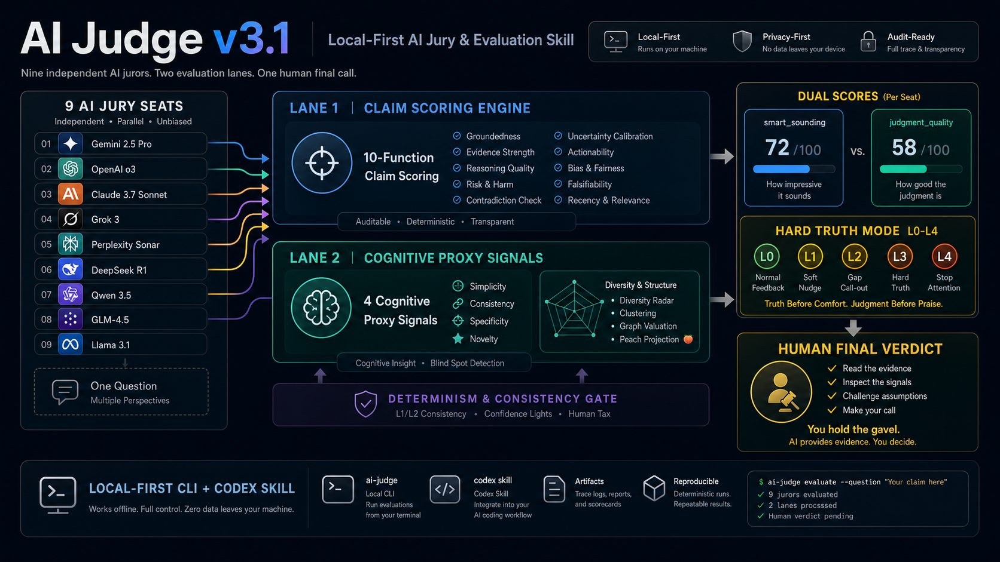
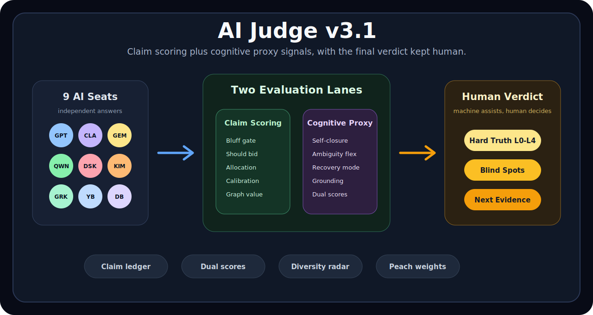
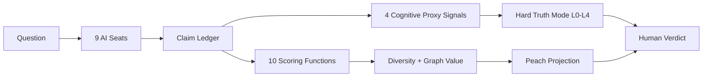

<p align="center">
  
  
  
  
  
</p>

<p align="center">
  
</p>

<h1 align="center">AI Judge v3.1</h1>
<p align="center"><strong>9 AI seats deliberate. 10 scoring functions audit claims. 4 cognitive proxy signals expose "sounds smart" vs "is smart". You hold the gavel.</strong></p>
<p align="center">A local-first Codex skill and CLI for multi-model evaluation, claim scoring, judgment-quality profiling, and human-final verdicts.</p>

<p align="center">
  <a href="#quick-start">Quick Start</a> ·
  <a href="#demo-result">Demo Result</a> ·
  <a href="docs/LAUNCH_DEMO_KIT.md">Launch Demo Kit</a> ·
  <a href="#what-v31-adds">What v3.1 Adds</a> ·
  <a href="#how-it-differs">Comparison</a> ·
  <a href="RELEASE_V3.md">Release Notes</a>
</p>

---

## Why People Notice It

Most AI comparison tools answer: **which model sounded best?**
AI Judge v3.1 asks a harder question: **which answer shows reliable judgment?**

It separates polished language from actual thinking quality, then gives the human a compact evidence package instead of another black-box synthesis.

## 30-Second Product Tour

<p align="center">
  
</p>

| Step | What happens | Why it matters |
|---:|---|---|
| 1 | 9 AI seats answer independently | Avoids one-model monologue bias |
| 2 | Claims enter the v2 scoring lane | Bluff, calibration, evidence, diversity, and graph value are auditable |
| 3 | Text enters the v3.1 cognitive lane | Finds polished-but-weak reasoning patterns |
| 4 | Hard Truth Mode chooses L0-L4 | Feedback gets sharper only when judgment quality lags |
| 5 | Human reads the evidence and decides | AI supports judgment, but does not replace it |



## Launch Assets

AI Judge now includes a ready-to-record launch and hackathon demo pack:

| Asset | Use it for |
|---|---|
| [`product/demo-video.html`](product/demo-video.html) | Auto-playing 90-second launch demo source for screen recording |
| [`Record-AI-Judge-Demo.command`](Record-AI-Judge-Demo.command) | One-click macOS recorder for the 90-second launch demo |
| [`Record-Microsoft-Agent-Academy.command`](Record-Microsoft-Agent-Academy.command) | One-click macOS recorder for the five-minute Microsoft submission video |
| [`docs/RECORDING_GUIDE.md`](docs/RECORDING_GUIDE.md) | Exact recording workflow and screen order |
| [`docs/LAUNCH_DEMO_KIT.md`](docs/LAUNCH_DEMO_KIT.md) | Voiceover, shot list, Product Hunt copy, Show HN copy, Chinese short post |
| [`docs/MICROSOFT_AGENT_ACADEMY.md`](docs/MICROSOFT_AGENT_ACADEMY.md) | Microsoft Agent Academy submission positioning and answers |
| [`assets/microsoft-agent-academy-architecture.svg`](assets/microsoft-agent-academy-architecture.svg) | Architecture diagram for hackathon submissions |
| [`examples/microsoft_agent_academy/copilot_cowork_packet.md`](examples/microsoft_agent_academy/copilot_cowork_packet.md) | Copilot/Cowork demo prompt, sample output, and AI Judge evaluation packet |

## What v3.1 Adds

| Layer | What it does | User-visible output |
|---|---|---|
| Dual scores | Separates fluent confidence from judgment quality | `smart_sounding_score` and `judgment_quality_score` |
| Self-closure | Detects when the answer stays trapped in one viewpoint | 自我视角闭环 |
| Ambiguity flexibility | Checks whether contradiction is explored or prematurely closed | 模糊性处理能力 |
| Recovery after negative feedback | Distinguishes repair from defensiveness | 反馈恢复模式 |
| Experience grounding | Rewards concrete tests, cases, and lived evidence | 经验锚定度 |
| Hard Truth Mode | Escalates when style outruns judgment | L0-L4 feedback levels |
| Heterogeneity exemption | Protects unusual but genuinely novel reasoning | Neurodiversity-friendly safeguard |

These are **textual proxy signals**, not medical or diagnostic claims. They help the user inspect reasoning behavior in the output.

## Core Signals at a Glance

| Signal | Good pattern | Risk pattern | Example output |
|---|---|---|---|
| Self-closure | Brings in outside viewpoints | Keeps returning to one self-centered frame | `self_reference_closure` |
| Ambiguity flexibility | Suspends, tests, and integrates contradictions | Chooses a side too quickly | `low_flexibility_choose_side` |
| Recovery after negative feedback | Uses challenge as new evidence | Defends, collapses, or performs agreement | `defensive_recovery` |
| Experience grounding | Names concrete data, cases, tests, and constraints | Floats in jargon and abstraction | `conceptual_fluency_without_grounding` |

## Demo Result

Reproducible local smoke test:

```bash
PYTHONPATH=. python3 tests/smoke_test_v3.py
```

Observed v3.1 demo behavior:

| Fixture | Smart-sounding | Judgment quality | Result |
|---|---:|---:|---|
| Shallow strategic jargon | 0.937 | 0.695 | L2 判断优先, hard truth active |
| Evidence-grounded reasoning | 0.879 | 0.913 | L0 普通反馈 |
| Full pipeline | steady confidence | exportable verdict | hard truth triggers when needed |

Example Hard Truth output:

```text
═══ 判断优先模式 ═══

smart_sounding: 0.94 | judgment_quality: 0.70
差距: 24% — 这段输出「听起来聪明」，但不应被直接采信。

最小修复动作：
  a. 你的哪个主张可以被证伪？
  b. 哪个反方观点可能是真的？
  c. 你下一步用什么数据或实验来验证？
```

## Quick Start

```bash
# Run full harness test suite (benchmark + regression + smoke)
PYTHONPATH=. python3 tests/run_harness.py

# V3.1 neuro-cognitive demo
python3 cli/main.py neuro-profile --demo

# Hard Truth Mode
python3 cli/main.py hard-truth --demo

# Full V3.1 pipeline
python3 cli/main.py v3-pipeline --demo

# V2 scoring remains available
python3 cli/main.py score-v2 --demo
```

## Harness Engineering

The `harness/` layer provides systematic, reproducible pipeline execution:

| Module | Purpose |
|--------|---------|
| `harness/runner.py` | Programmatic API for all pipeline operations |
| `harness/benchmark.py` | Golden-dataset testing with pass/fail thresholds |
| `harness/regression.py` | Cross-version consistency detection |
| `harness/config.py` | YAML-based profiles (default, strict, fast, ci) |
| `harness/reporter.py` | JSON, Markdown, and HTML output |

```python
from harness import AIJudgeHarness
h = AIJudgeHarness(config="ci")
result = h.run_full_v3("Your analysis text here")
print(result.passed, result.data)
```

CI runs `tests/run_harness.py` on every push and PR. Docker build is gated on harness passing.

```bash
ai-judge jury --question "Your question here"
ai-judge collect --run latest
ai-judge verdict --run latest
```

## v2 to v3.1

| Area | v2 | v3.1 |
|---|---|---|
| Claim quality | 10 scoring functions, bluff gates, diversity radar | Same, plus judgment-quality profiling |
| Model value | `graph_value_v2` and Two Peaches allocation | Same, now informed by cognitive risk flags |
| Human role | Final verdict owner | Final verdict owner, with clearer blind-spot feedback |
| Failure mode caught | Unsupported confidence and echo-chamber consensus | Unsupported confidence, echo chambers, and performative intelligence |
| Main new command | `score-v2 --demo` | `neuro-profile`, `hard-truth`, `v3-pipeline` |

## How It Differs

| System | Primary job | Final owner | What AI Judge v3.1 adds |
|---|---|---|---|
| Hermes-compatible skill | Package an agent workflow | User/host agent | Full jury workflow, scoring engine, and v3.1 judgment profiling |
| llm-council | Peer review and chairman synthesis | Chairman LLM | Human-final decision, claim ledger, local-first CLI/Docker package |
| Perplexity Model Council | Web model comparison and synthesis | Perplexity synthesizer | Inspectable formulas, local workflow, releaseable Codex skill |
| AI Judge v3.1 | Evidence workflow for consequential decisions | Human | Scoring, diversity, graph value, hard truth, and cognitive proxy signals |

## Repository Map

```text
ai-judge/
├── README.md
├── RELEASE_V3.md
├── SKILL.md
├── Publish-AI-Judge-V3.command
├── core/
│   ├── neuro_profiler.py      # 4 proxy signals + dual scores
│   ├── hard_truth.py          # L0-L4 judgment-first feedback
│   ├── determinism.py         # consistency + confidence lights + v3 pipeline
│   ├── scoring_v2.py          # v2 scoring plus v3 bridge
│   ├── formula_engine.py      # 10 auditable scoring formulas
│   ├── anchor_engine.py       # goal anchoring and taste cards
│   ├── mirror.py              # thinking fingerprint and growth narrative
│   └── ...
├── cli/main.py                # unified CLI
├── tests/smoke_test_v3.py
├── product/landing.html
├── Dockerfile
└── docker-compose.yml
```

## Open-Core Boundary

| Public in this repo | Paid/private runtime |
|---|---|
| CLI surface and v2/v3 demos | Production browser/CDP collector |
| Scoring formulas and cognitive proxy functions | Managed multi-model runtime |
| Codex/Hermes-compatible `SKILL.md` | SaaS license server |
| Docker, schemas, docs, examples | Team deployment and support layer |
| Swift bridge source | Hosted integrations |

## Documentation

| Document | Purpose |
|---|---|
| [RELEASE_V3.md](RELEASE_V3.md) | v3.1 release notes and migration notes |
| [docs/QUICKSTART.md](docs/QUICKSTART.md) | Setup and first demos |
| [docs/ARCHITECTURE.md](docs/ARCHITECTURE.md) | System design |
| [docs/COMPARISON.md](docs/COMPARISON.md) | Comparison with other council-style tools |
| [product/landing.html](product/landing.html) | Product landing page |

## License

BSL 1.1. Source available. Production use requires a license.
