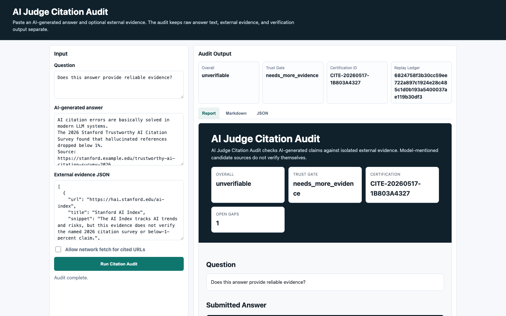
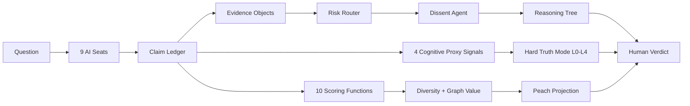

<p align="center">
  
  <a href="https://huggingface.co/spaces/reguorier/ai-judge-citation-audit"></a>
  
  
  
  
  
  
  
</p>

<p align="center">
  
</p>

<h1 align="center">AI Judge v3.6</h1>
<p align="center"><strong>Open-source citation audit for AI-generated answers.</strong></p>
<p align="center">Catch fabricated, weak, irrelevant, unverifiable, and contradicted citations before an AI-generated report, paper, README, or client memo is published.</p>

<p align="center">
  <a href="#citation-audit-in-60-seconds">Citation Audit</a> ·
  <a href="https://huggingface.co/spaces/reguorier/ai-judge-citation-audit">Live Space</a> ·
  <a href="#quick-start">Quick Start</a> ·
  <a href="#demo-result">Demo Result</a> ·
  <a href="docs/LAUNCH_CITATION_AUDIT.md">Launch Plan</a> ·
  <a href="docs/PRO_EARLY_ACCESS.md">Pro Early Access</a> ·
  <a href="docs/LAUNCH_DEMO_KIT.md">Launch Demo Kit</a> ·
  <a href="#what-v33-adds">What v3.3 Adds</a> ·
  <a href="#what-v32-adds">What v3.2 Adds</a> ·
  <a href="#how-it-differs">Comparison</a> ·
  <a href="RELEASE_V3_3.md">v3.3 Notes</a> ·
  <a href="RELEASE_V3_2.md">v3.2 Notes</a>
</p>

---

## Why People Notice It

Most AI comparison tools answer: **which model sounded best?**
AI Judge v3.3 asks a harder question: **which answer can show its evidence, survive dissent, and explain the path to judgment without nine models quietly copying the same source?**

It separates polished language from actual thinking quality, then gives the human a compact evidence package instead of another black-box synthesis.

## Citation Audit in 60 Seconds

Most LLM eval tools ask whether an answer is good. AI Judge v3.6 starts with a narrower publish-risk question: **which citations can actually be trusted?**

Try it in the browser first:

<p>
  <a href="https://huggingface.co/spaces/reguorier/ai-judge-citation-audit"><strong>Open the Hugging Face Space</strong></a>
</p>

<p align="center">
  
</p>

```bash
PYTHONPATH=. python cli/main.py audit examples/fake-citation.md \
  --html reports/fake-citation-audit.html \
  --json reports/fake-citation-audit.json
```

The audit returns:

| Output | Why it matters |
|---|---|
| `verified` / `weakly_verified` / `irrelevant` / `unverifiable` / `contradicted` | Citation-level status instead of vague prose confidence |
| Certification ID | Stable audit handle for reports and CI artifacts |
| Replay Ledger | Raw answer is preserved; the judge does not rewrite model text |
| Evidence Broker | Model-mentioned candidate sources are separated from supplied/fetched external evidence |
| HTML + JSON report | Human-readable proof plus automation-friendly output |

Launch demos:

```bash
PYTHONPATH=. python cli/main.py audit examples/fake-citation.md --html reports/fake-citation-audit.html
PYTHONPATH=. python cli/main.py audit examples/product-no-evidence.md --html reports/product-no-evidence-audit.html
PYTHONPATH=. python cli/main.py audit examples/sounds-smart-low-judgment.md --html reports/sounds-smart-low-judgment-audit.html
PYTHONPATH=. python tools/run_citation_bench.py
```

Demo reports: [`fake citation`](reports/fake-citation-audit.html), [`product plan without evidence`](reports/product-no-evidence-audit.html), [`sounds smart, low judgment`](reports/sounds-smart-low-judgment-audit.html), [`legal memo contradicted`](reports/legal-memo-contradicted-audit.html), [`open-source README irrelevant`](reports/opensource-readme-irrelevant-audit.html).

`contradicted` audits intentionally return a non-zero CLI status because they should block publication; the generated HTML/JSON report is still written.

The first public benchmark is [`citation-bench/citation-bench-100.jsonl`](citation-bench/citation-bench-100.jsonl): 100 deterministic cases covering verified, weak, irrelevant, unverifiable, and contradicted citation behavior.

Hard-mode launch cases live in [`citation-bench/citation-bench-hard-10.jsonl`](citation-bench/citation-bench-hard-10.jsonl):

```bash
PYTHONPATH=. python tools/run_citation_bench.py \
  --bench citation-bench/citation-bench-hard-10.jsonl \
  --fail-under 0.95
```

Want to help without reading the whole codebase? Start here:

| Public issue | What to add |
|---|---|
| [Hard citation hallucination cases](https://github.com/reguorier/ai-judge/issues/2) | Plausible fake reports, real-but-irrelevant sources, contradicted claims |
| [`unverifiable` vs `contradicted`](https://github.com/reguorier/ai-judge/issues/3) | Edge cases where missing evidence and refuting evidence are easy to confuse |
| [Batch/PDF/Docx audit demand](https://github.com/reguorier/ai-judge/issues/4) | Real workflow needs before Pro batch audit is built |
| [Demo gallery examples](https://github.com/reguorier/ai-judge/issues/5) | Public-safe AI answers that deserve a citation audit report |

## 30-Second Product Tour

<p align="center">
  
</p>

| Step | What happens | Why it matters |
|---:|---|---|
| 1 | 9 fixed persona seats answer independently | Creates structured divergence instead of bland consensus |
| 2 | Claims enter the v2 scoring lane | Bluff, calibration, evidence, diversity, and graph value are auditable |
| 3 | Evidence objects attach sources | Tool, rule, harness, and precedent evidence become inspectable |
| 4 | Dissent challenges weak support | The system argues against itself before raising confidence |
| 5 | Reasoning tree renders the path | Facts, evidence, rules, dissent, and conclusion become visible |
| 6 | Human reads the evidence and decides | AI supports judgment, but does not replace it |



## What v3.3 Adds

COUNCIL-004 turns the nine seats from interchangeable model names into stable, inspectable judging roles. Each seat now carries a fixed persona card with MBTI-style operating mode, risk preference, cognitive bias, ideology, strengths, weaknesses, and a system-prompt injection for jury dispatch.

| Layer | What it does | User-visible output |
|---|---|---|
| Fixed seat personas | Keeps Gemini, ChatGPT, DeepSeek, Qwen, Kimi, Grok, Yuanbao, MiMo, and Doubao behavior intentionally different | `ai-judge seats --list`, `ai-judge seats --show grok` |
| Jury prompt injection | Adds seat-specific operating instructions before the question | `render_jury_prompt(seat, question)` |
| Evidence trace | Classifies claim support as L1 explicit citation, L2 implied source, or L3 no citation | `ai-judge trace --claim "..."` |
| Contamination scan | Finds citation sources shared by 3+ seats so consensus does not masquerade as independence | `ai-judge trace --demo`, `ai-judge trace --claims-file ...` |

```bash
# Inspect the 9 fixed persona seats
ai-judge seats --list
ai-judge seats --show grok

# Trace evidence sources
ai-judge trace --demo
ai-judge trace --claim "According to the 2025 IMF report, global debt reached $300T"
ai-judge trace --claims-file path/to/claim-ledger.json
```

## What v3.2 Adds

<p align="center">
  
</p>

| Layer | What it does | User-visible output |
|---|---|---|
| Evidence objects | Gives each claim a source-backed evidence bundle | `tool_result`, `rule_match`, `harness_result`, `precedent` |
| Dissent agent | Challenges weak evidence, single-source support, and overconfidence | Counterarguments and required checks |
| Reasoning tree | Turns the verdict path into expandable JSON/UI nodes | Facts -> Evidence -> Rules -> Dissent -> Conclusion |
| Risk router | Chooses review depth by sensitive surface and diff shape | `full_jury`, `standard_dissent`, `standard`, `fast_check` |
| Enhanced confidence | Adds evidence strength and dissent penalty to confidence lights | More honest low/medium/high confidence |

The full product package also adds a TypeScript reasoning-tree UI under `frontend/` and a Rust reference engine under `rust-engine/`.

## Launch Assets

AI Judge now includes a ready-to-record launch and hackathon demo pack:

| Asset | Use it for |
|---|---|
| [`product/demo-video.html`](product/demo-video.html) | Auto-playing 90-second launch demo source for screen recording |
| [`Record-AI-Judge-Demo.command`](Record-AI-Judge-Demo.command) | One-click macOS recorder for the 90-second launch demo |
| [`Record-Microsoft-Agent-Academy.command`](Record-Microsoft-Agent-Academy.command) | One-click macOS recorder for the five-minute Microsoft submission video |
| [`docs/RECORDING_GUIDE.md`](docs/RECORDING_GUIDE.md) | Exact recording workflow and screen order |
| [`docs/LAUNCH_DEMO_KIT.md`](docs/LAUNCH_DEMO_KIT.md) | Voiceover, shot list, Product Hunt copy, Show HN copy, Chinese short post |
| [`docs/MICROSOFT_AGENT_ACADEMY.md`](docs/MICROSOFT_AGENT_ACADEMY.md) | Microsoft Agent Academy submission positioning and answers |
| [`assets/microsoft-agent-academy-architecture.svg`](assets/microsoft-agent-academy-architecture.svg) | Architecture diagram for hackathon submissions |
| [`examples/microsoft_agent_academy/copilot_cowork_packet.md`](examples/microsoft_agent_academy/copilot_cowork_packet.md) | Copilot/Cowork demo prompt, sample output, and AI Judge evaluation packet |

## Citation Audit Growth Kit

The current monetization path is intentionally narrow: prove citation audit value first, then ask for Pro access only from users who need batch, CI, or document workflows.

| Asset | Purpose |
|---|---|
| [`docs/CITATION_AUDIT_QUICKSTART.md`](docs/CITATION_AUDIT_QUICKSTART.md) | Reproducible local demo, report gallery, and benchmark command |
| [`docs/LAUNCH_CITATION_AUDIT.md`](docs/LAUNCH_CITATION_AUDIT.md) | 30-day launch plan, public demos, and stop/go thresholds |
| [`docs/UNVERIFIABLE_IS_NOT_FALSE.md`](docs/UNVERIFIABLE_IS_NOT_FALSE.md) | Public explainer for the most important trust-boundary concept |
| [`docs/BATCH_AUDIT_SPEC.md`](docs/BATCH_AUDIT_SPEC.md) | Pro batch-audit scope without building billing too early |
| [`docs/GITHUB_ACTION_CITATION_AUDIT.md`](docs/GITHUB_ACTION_CITATION_AUDIT.md) | CI integration example for Markdown/document PRs |
| [`docs/AI_DECISION_AUDIT_SAMPLE.md`](docs/AI_DECISION_AUDIT_SAMPLE.md) | Concrete sample deliverable for audit-service conversations |
| [`docs/AI_COLLECTIVE_BLIND_SPOTS_BLOG.md`](docs/AI_COLLECTIVE_BLIND_SPOTS_BLOG.md) | Publish-ready long-form launch essay |
| [`docs/PRO_EARLY_ACCESS.md`](docs/PRO_EARLY_ACCESS.md) | First paid-signal offer and manual purchase flow |
| [`product/pro_early_access.html`](product/pro_early_access.html) | Static early-access page for the $49 lifetime test |
| [`growth/30_day_autopilot_execution.md`](growth/30_day_autopilot_execution.md) | Day-by-day automation table and current asset map |
| [`growth/metrics_dashboard.md`](growth/metrics_dashboard.md) | Stop/go tracking for stars, replies, feature asks, and paid signals |
| [`growth/outreach_targets.md`](growth/outreach_targets.md) | 20-target outreach queue for AI newsletters, legal-tech, research ops, and devtools |
| [`growth/free_audit_offer.md`](growth/free_audit_offer.md) | Three free audit offer used to collect testimonials |
| [`growth/anonymized_audit_permission_request.md`](growth/anonymized_audit_permission_request.md) | Permission template for a real anonymized Day-24 audit |
| [`growth/zhihu_launch_post.md`](growth/zhihu_launch_post.md) | Chinese long-form launch post |
| [`product/social_quote_cards.html`](product/social_quote_cards.html) | Three quote-card layouts for short-form launch visuals |
| [`docs/GITHUB_SPONSORS.md`](docs/GITHUB_SPONSORS.md) | GitHub Sponsors copy and tier positioning |

## Citation Audit FAQ

**Is `unverifiable` the same as false?**
No. It means the current isolated evidence layer is insufficient. `contradicted` is reserved for evidence that explicitly refutes the claim.

**Does AI Judge rewrite the model answer?**
No. The Replay Ledger preserves the raw answer. The judge adds verification, hashes, and status labels around it.

**Does a model-mentioned source count as evidence?**
No. A model can hallucinate a source and then cite it confidently. Candidate sources must be checked against supplied or fetched external evidence.

**Why start with citation audit instead of full Grand Judge?**
Citation trust is a narrow, testable baseline. Once citation truthiness is bounded, broader council scoring can build on a cleaner evidence layer.

**What becomes Pro?**
Batch audit, GitHub Action advanced mode, history ledger, network-backed Evidence Broker, and document parsing. Single-file local audit stays free.

## v3.1 Foundation

| Layer | What it does | User-visible output |
|---|---|---|
| Dual scores | Separates fluent confidence from judgment quality | `smart_sounding_score` and `judgment_quality_score` |
| Self-closure | Detects when the answer stays trapped in one viewpoint | 自我视角闭环 |
| Ambiguity flexibility | Checks whether contradiction is explored or prematurely closed | 模糊性处理能力 |
| Recovery after negative feedback | Distinguishes repair from defensiveness | 反馈恢复模式 |
| Experience grounding | Rewards concrete tests, cases, and lived evidence | 经验锚定度 |
| Hard Truth Mode | Escalates when style outruns judgment | L0-L4 feedback levels |
| Heterogeneity exemption | Protects unusual but genuinely novel reasoning | Neurodiversity-friendly safeguard |

These are **textual proxy signals**, not medical or diagnostic claims. They help the user inspect reasoning behavior in the output.

## Core Signals at a Glance

| Signal | Good pattern | Risk pattern | Example output |
|---|---|---|---|
| Self-closure | Brings in outside viewpoints | Keeps returning to one self-centered frame | `self_reference_closure` |
| Ambiguity flexibility | Suspends, tests, and integrates contradictions | Chooses a side too quickly | `low_flexibility_choose_side` |
| Recovery after negative feedback | Uses challenge as new evidence | Defends, collapses, or performs agreement | `defensive_recovery` |
| Experience grounding | Names concrete data, cases, tests, and constraints | Floats in jargon and abstraction | `conceptual_fluency_without_grounding` |

## Demo Result

Reproducible local smoke tests:

```bash
PYTHONPATH=. python3 tests/smoke_test_v3_2.py
PYTHONPATH=. python3 tests/smoke_test_v3.py
PYTHONPATH=. python3 tests/smoke_test_council_004.py
```

Observed v3.3 demo behavior:

| Fixture | Personas | Trace | Result |
|---|---:|---|---|
| COUNCIL-004 smoke | 9 seats | L1/L2/L3 + shared-source scan | Pseudo-consensus detectable |

Observed v3.2 demo behavior:

| Fixture | Risk route | Evidence | Dissent | Result |
|---|---|---:|---|---|
| Security/payment checkout change | `full_jury` | 3 items | triggered | Reasoning tree exportable |

Observed v3.1 demo behavior:

| Fixture | Smart-sounding | Judgment quality | Result |
|---|---:|---:|---|
| Shallow strategic jargon | 0.937 | 0.695 | L2 判断优先, hard truth active |
| Evidence-grounded reasoning | 0.879 | 0.913 | L0 普通反馈 |
| Full pipeline | steady confidence | exportable verdict | hard truth triggers when needed |

Example Hard Truth output:

```text
═══ 判断优先模式 ═══

smart_sounding: 0.94 | judgment_quality: 0.70
差距: 24% — 这段输出「听起来聪明」，但不应被直接采信。

最小修复动作：
  a. 你的哪个主张可以被证伪？
  b. 哪个反方观点可能是真的？
  c. 你下一步用什么数据或实验来验证？
```

## Quick Start

```bash
# Run full harness test suite (benchmark + regression + smoke)
PYTHONPATH=. python3 tests/run_harness.py

# V3.1 neuro-cognitive demo
python3 cli/main.py neuro-profile --demo

# Hard Truth Mode
python3 cli/main.py hard-truth --demo

# Full V3.1 pipeline
python3 cli/main.py v3-pipeline --demo

# V3.2 evidence + dissent + reasoning tree pipeline
python3 cli/main.py v3.2-pipeline --demo
PYTHONPATH=. python3 tests/smoke_test_v3_2.py

# COUNCIL-004 persona seats + evidence trace
python3 cli/main.py seats --list
python3 cli/main.py seats --show grok
python3 cli/main.py trace --demo
python3 cli/main.py trace --claim "According to the 2025 IMF report, global debt reached $300T"

# V2 scoring remains available
python3 cli/main.py score-v2 --demo
```

## Harness Engineering

The `harness/` layer provides systematic, reproducible pipeline execution:

| Module | Purpose |
|--------|---------|
| `harness/runner.py` | Programmatic API for all pipeline operations |
| `harness/benchmark.py` | Golden-dataset testing with pass/fail thresholds |
| `harness/regression.py` | Cross-version consistency detection |
| `harness/config.py` | YAML-based profiles (default, strict, fast, ci) |
| `harness/reporter.py` | JSON, Markdown, and HTML output |

```python
from harness import AIJudgeHarness
h = AIJudgeHarness(config="ci")
result = h.run_full_v3("Your analysis text here")
print(result.passed, result.data)
```

CI runs `tests/run_harness.py` on every push and PR. Docker build is gated on harness passing.

```bash
ai-judge jury --question "Your question here"
ai-judge collect --run latest
ai-judge verdict --run latest
```

## v2 to v3.3

| Area | v2 | v3.1 | v3.2 | v3.3 / COUNCIL-004 |
|---|---|---|---|---|
| Claim quality | 10 scoring functions, bluff gates, diversity radar | Same, plus judgment-quality profiling | Same, plus evidence object tracing | Same, plus L1/L2/L3 citation trace |
| Model value | `graph_value_v2` and Two Peaches allocation | Same, now informed by cognitive risk flags | Same, now routed by risk depth and dissent | Same, with fixed persona roles for stable divergence |
| Human role | Final verdict owner | Final verdict owner, with clearer blind-spot feedback | Final verdict owner, with visible reasoning path | Final verdict owner, with source-contamination warnings |
| Failure mode caught | Unsupported confidence and echo-chamber consensus | Unsupported confidence, echo chambers, performative intelligence | Unsupported evidence, missing dissent, hidden risk surfaces | Pseudo-consensus from shared citations and bland seat behavior |
| Main new command | `score-v2 --demo` | `neuro-profile`, `hard-truth`, `v3-pipeline` | `v3.2-pipeline --demo` | `seats`, `trace` |

## How It Differs

| System | Primary job | Final owner | What AI Judge v3.3 adds |
|---|---|---|---|
| Hermes-compatible skill | Package an agent workflow | User/host agent | Full jury workflow, scoring engine, judgment profiling, and auditable reasoning |
| llm-council | Peer review and chairman synthesis | Chairman LLM | Human-final decision, claim ledger, dissent, persona seats, and local-first CLI/Docker package |
| Perplexity Model Council | Web model comparison and synthesis | Perplexity synthesizer | Inspectable formulas, reasoning-tree artifacts, evidence trace, and local workflow |
| AI Judge v3.3 | Evidence workflow for consequential decisions | Human | Scoring, diversity, graph value, hard truth, evidence tracing, contamination detection, dissent, and risk routing |

## Repository Map

```text
ai-judge/
├── README.md
├── RELEASE_V3.md
├── RELEASE_V3_3.md
├── SKILL.md
├── Publish-AI-Judge-V3.command
├── core/
│   ├── neuro_profiler.py      # 4 proxy signals + dual scores
│   ├── hard_truth.py          # L0-L4 judgment-first feedback
│   ├── determinism.py         # consistency + confidence lights + v3 pipeline
│   ├── scoring_v2.py          # v2 scoring plus v3/v3.2 bridge
│   ├── seat_personas.py       # v3.3 fixed persona cards and prompt injection
│   ├── evidence_trace.py      # v3.3 L1/L2/L3 source tracing and contamination scan
│   ├── evidence.py            # v3.2 structured evidence objects
│   ├── dissent.py             # v3.2 Devil's Advocate challenge
│   ├── reasoning_trace.py     # v3.2 reasoning tree builder
│   ├── risk_router.py         # v3.2 risk-based review depth
│   ├── formula_engine.py      # 10 auditable scoring formulas
│   ├── anchor_engine.py       # goal anchoring and taste cards
│   ├── mirror.py              # thinking fingerprint and growth narrative
│   └── ...
├── cli/main.py                # unified CLI
├── frontend/                  # TypeScript reasoning-tree UI components
├── rust-engine/               # Rust reference implementation
├── tests/smoke_test_v3.py
├── product/landing.html
├── Dockerfile
└── docker-compose.yml
```

## Open-Core Boundary

| Public in this repo | Paid/private runtime |
|---|---|
| CLI surface and v2/v3/v3.2/v3.3 demos | Production browser/CDP collector |
| Scoring formulas, cognitive proxy functions, evidence/dissent demo, persona/trace tools | Managed multi-model runtime |
| Codex/Hermes-compatible `SKILL.md` | SaaS license server |
| Docker, schemas, docs, examples | Team deployment and support layer |
| Swift bridge source | Hosted integrations |

## Documentation

| Document | Purpose |
|---|---|
| [RELEASE_V3_3.md](RELEASE_V3_3.md) | v3.3 COUNCIL-004 release notes and persona/trace commands |
| [RELEASE_V3_2.md](RELEASE_V3_2.md) | v3.2 release notes and Tianfu migration notes |
| [RELEASE_V3.md](RELEASE_V3.md) | v3.1 release notes and migration notes |
| [docs/QUICKSTART.md](docs/QUICKSTART.md) | Setup and first demos |
| [docs/ARCHITECTURE.md](docs/ARCHITECTURE.md) | System design |
| [docs/COMPARISON.md](docs/COMPARISON.md) | Comparison with other council-style tools |
| [docs/v3.2-source/](docs/v3.2-source/) | Full-package source discussion, technical spec, and roadmap |
| [product/landing.html](product/landing.html) | Product landing page |
| [product/pro_early_access.html](product/pro_early_access.html) | Pro early-access page |
| [docs/PRO_EARLY_ACCESS.md](docs/PRO_EARLY_ACCESS.md) | Manual early-access purchase flow |

## License

BSL 1.1. Source available. Production use requires a license.

## Contact

For license keys, support, or partnership questions, email [reguorider@gmail.com](mailto:reguorider@gmail.com).
