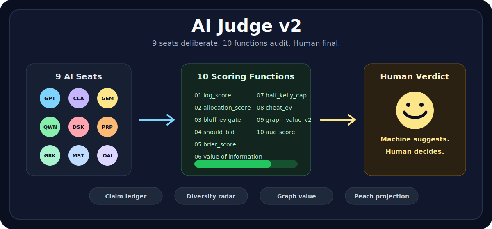

<p align="center">
  
  
  
  
  
  
</p>

<p align="center">
  
</p>

<h1 align="center">AI Judge</h1>
<p align="center"><strong>9 AI models deliberate. 10 scoring functions audit the claims. You hold the gavel.</strong></p>
<p align="center">A local-first Codex skill for multi-model evaluation, claim scoring, and human-final verdicts.</p>

---

## Why This Exists

Single-model answers are fluent, but hard to cross-examine. Simple multi-model tools improve coverage, but often hand the final decision to another synthesizer model.

AI Judge v2 keeps the human in charge and makes the intermediate reasoning auditable:

1. Collect independent answers from 9 AI seats.
2. Convert answers into claim-level evidence.
3. Run a 10-function scoring engine over bluff risk, calibration, diversity, graph value, and scarcity allocation.
4. Produce a verdict package that shows where models agree, where they diverge, and why a claim got its weight.

```mermaid
flowchart LR
    Q["User Question"] --> S["9 Independent Seats"]
    S --> L["Claim Ledger"]
    L --> G1["Gate 1<br/>Bluff EV"]
    G1 --> G2["Gate 2<br/>Should Bid"]
    G2 --> G3["Gate 3<br/>Allocation Score"]
    G3 --> D["Diversity Radar<br/>Variance + Clusters"]
    D --> V["Graph Value<br/>Correctness-first"]
    V --> P["Peach Projection<br/>Top-k weight allocation"]
    P --> H["Human Verdict"]

    style Q fill:#d9ecff,color:#111
    style G1 fill:#ffd6d2,color:#111
    style D fill:#dff7df,color:#111
    style P fill:#fff1b8,color:#111
    style H fill:#d6f5d6,color:#111
```



## Install

### As a Codex Skill

```text
$skill-installer install https://github.com/reguorier/ai-judge
```

Restart Codex after installing so the skill is discovered.

### As a CLI

```bash
pip install ai-judge
ai-judge score-v2 --demo
```

```bash
docker pull ghcr.io/reguorier/ai-judge:latest
docker compose up
```

Production commands (`jury`, `collect`, `verdict`, `reflect`) require the paid `ai-judge-core` package. The public repo includes the Codex skill, CLI surface, v2 scoring engine, schemas, docs, Docker packaging, and bridge source.

## v1 vs v2

| Dimension | v1 behavior | v2 scoring engine |
|---|---|---|
| Claim score | 5-factor multiplication; one weak factor can crush the whole claim | Weighted allocation plus explicit risk penalty |
| Confidence | Discrete confidence bucket | Continuous `log_score`; overconfident misses cost exponentially more |
| Bluff handling | No direct high-confidence/no-evidence gate | `evaluate_bluff_ev` blocks or flags unsupported certainty |
| Participation | Every seat is pushed to answer | `should_bid` lets seats abstain when domain match or confidence is too low |
| Consensus | Agreement is treated as comfort | `normalized_graph_variance` detects echo-chamber consensus |
| Model families | No cluster visibility | `cluster_strategy_vectors` highlights implicit alignment |
| Seat value | Historical reliability only | `graph_value_v2`: correctness first, rarity only after calibration passes |
| Final weight | Broad shared weight | `peach_projection(k=2)` gives primary influence to the top two seats per claim |
| Manipulation surface | Rule-based warnings | `cheat_ev`, `bluff_ev`, and stake settlement expose incentives |
| Human role | Reads final answer | Reviews the claim ledger, risk flags, weight distribution, and final verdict |

## Reproducible Demo

Run:

```bash
ai-judge score-v2 --demo
```

The demo fixture simulates a 9-seat, 5-claim jury. It is not a benchmark against live providers; it is a reproducible scoring-engine check that shows the v2 gates and allocations working end to end.

| Check | Demo result |
|---|---:|
| Claims scored | 5 |
| Credible claims | 3 |
| Rejected claims | 2 |
| Claims blocked by bluff gate | 2 |
| Average claim score | 0.4952 |
| Average log score where outcome is known | 0.2485 |
| Diversity index | 0.008405 |
| Diversity health | CRITICAL echo-chamber risk |
| Largest detected cluster | 9 seats |
| Top graph-value seat | DeepSeek |
| Average graph value | 0.939104 |
| Peach winners | DeepSeek, Gemini |
| Winner weights | DeepSeek 0.332302; Gemini 0.317698 |

The practical difference: a claim with strong authority and evidence survives as nuanced evidence, while "Trust me, this market will 10x" at 0.99 confidence with zero evidence is blocked before it can influence the verdict.

## The 10 Auditable Functions

| # | Function | Phase | What it audits |
|---:|---|:---:|---|
| 1 | `log_score` | Calibration | Penalizes confident wrong predictions more than uncertain wrong predictions |
| 2 | `allocation_score` | Claim scoring | Replaces brittle multiplication with weighted evidence allocation |
| 3 | `evaluate_bluff_ev` | Bluff gate | Detects high confidence with insufficient evidence |
| 4 | `should_bid` | Participation | Lets seats abstain when expected value is negative |
| 5 | `brier_score` | Calibration | Measures probability calibration with squared error |
| 6 | `calculate_voi` | Tool economics | Checks whether extra information was worth its cost |
| 7 | `half_kelly_cap` | Risk sizing | Caps exposure when confidence, odds, or sample size are weak |
| 8 | `cheat_ev` | Incentives | Surfaces positive expected value for manipulation |
| 9 | `graph_value_v2` | Seat value | Values seats by correctness, with gated rarity/replay/demand bonuses |
| 10 | `auc_score` | Ranking quality | Measures whether higher scores rank true claims above false ones |

## How AI Judge Differs

| System | Primary job | Model count | Final answer owner | Evidence model | Local-first | What AI Judge adds |
|---|---|---:|---|---|:---:|---|
| Hermes-compatible skill | Skill packaging and output envelope | N/A | User/host agent | Structured output contract | Yes | A full jury workflow plus v2 scoring functions |
| llm-council | Multi-LLM peer review and chairman synthesis | Configurable | Chairman LLM synthesizes | Anonymous ranking and peer review | No, OpenRouter/API path | Claim ledger, bluff gate, diversity radar, human-final verdict |
| Perplexity Model Council | Web research mode with a unified synthesized answer | 3 | Perplexity synthesizer model | Agreement/disagreement summary | No, web product | 9-seat local workflow, auditable formulas, Docker/CLI/skill packaging |
| AI Judge v2 | Human-centric multi-model verdict system | 9 seats | Human | Claim-level functions, weights, risk flags, and audit trail | Yes | The whole stack |

Source notes:

- [llm-council](https://llm-council.dev/) describes a three-stage flow: parallel generation, anonymous peer review/ranking, and a Chairman LLM synthesis.
- [Perplexity Model Council](https://www.perplexity.ai/help-center/zh-CN/articles/13641704-%E4%BB%80%E4%B9%88%E6%98%AF-model-council) is documented as a web-only Max/Enterprise Max feature that queries three models and synthesizes a unified answer showing agreement and disagreement.
- [Hermes skills](https://hermes-agent.ai/blog/hermes-agent-skills-guide) are procedural `SKILL.md` packages; AI Judge treats Hermes compatibility as the delivery format, not the judge.

## Repository Map

```text
ai-judge-skill/
├── README.md                      # GitHub homepage
├── RELEASE_v2.md                  # 10 functions + migration guide
├── SKILL.md                       # Codex skill entrypoint
├── core/
│   ├── formula_engine.py          # 10 auditable scoring functions
│   ├── scoring_v2.py              # 3-gate claim scoring + pipeline
│   ├── consensus_v2.py            # Diversity radar + clustering + graph value
│   ├── peach_projection.py        # Two Peaches scarcity allocation
│   ├── hermes_output.py           # Hermes output envelope
│   └── license_validator.py       # Community license shim
├── cli/main.py                    # ai-judge score-v2 --demo
├── bridges/                       # Swift desktop bridges
├── docs/                          # Architecture, comparison, philosophy, quickstart
├── product/                       # Landing page and monetization notes
├── Dockerfile
├── docker-compose.yml
└── .github/workflows/publish.yml
```

## Open-Core Boundary

| Public in this repo | Private/paid core |
|---|---|
| Codex skill metadata | Production collector runtime |
| CLI surface and `score-v2 --demo` | Browser/CDP automation engine |
| v2 scoring engine formulas | Production scoring orchestration |
| Hermes output envelope | License server and team workflows |
| Schemas, docs, Docker, CI | Enterprise integrations |
| Swift bridge source | Managed SaaS deployment |

## Documentation

| Document | Purpose |
|---|---|
| [RELEASE_v2.md](RELEASE_v2.md) | v2 scoring-engine notes and migration guide |
| [docs/QUICKSTART.md](docs/QUICKSTART.md) | Setup and first run |
| [docs/ARCHITECTURE.md](docs/ARCHITECTURE.md) | System design |
| [docs/COMPARISON.md](docs/COMPARISON.md) | Deeper comparison notes |
| [docs/HUMAN_CENTRIC.md](docs/HUMAN_CENTRIC.md) | Why the human keeps final authority |
| [SKILL.md](SKILL.md) | Codex skill definition |

## License

AI Judge is published under BSL 1.1. Public contributions are welcome for CLI usability, bridge review, docs, schemas, and sanitized examples.

Contact: [reguorider@gmail.com](mailto:reguorider@gmail.com)
