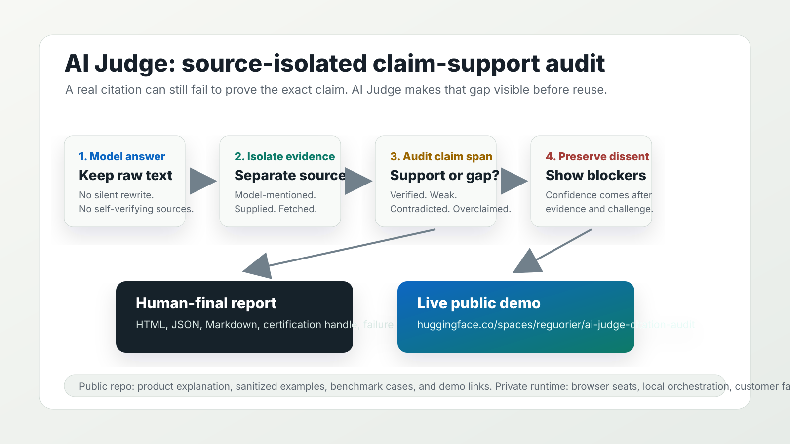
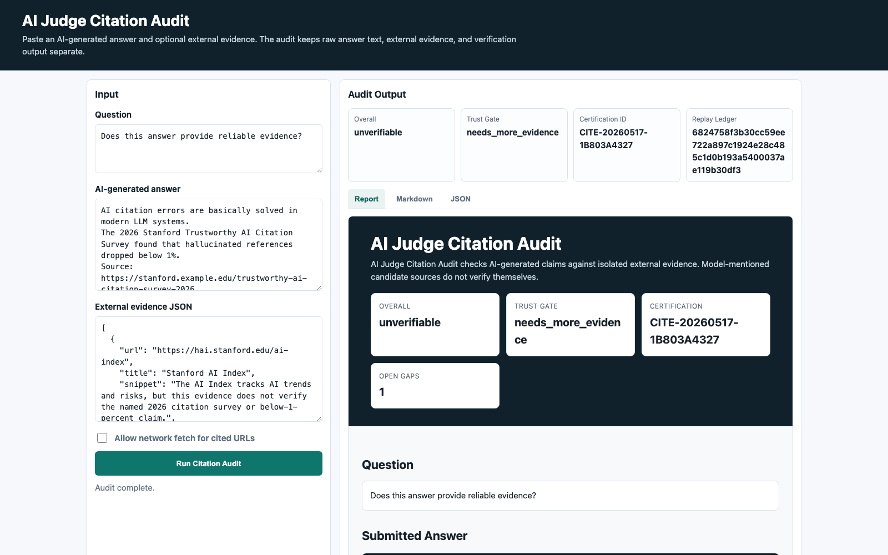

<p align="center">
  
  <a href="https://huggingface.co/spaces/reguorier/ai-judge-citation-audit"></a>
  
  
  
</p>

<p align="center">
  
</p>

<h1 align="center">AI Judge</h1>
<p align="center"><strong>Source-isolated claim-support audit for AI-generated answers.</strong></p>
<p align="center">AI Judge checks whether citations and isolated sources actually support the exact claims a model answer made before that answer is reused in a report, memo, README, paper, or agent workflow.</p>
<p align="center"><strong>Live demo:</strong> <a href="https://huggingface.co/spaces/reguorier/ai-judge-citation-audit">huggingface.co/spaces/reguorier/ai-judge-citation-audit</a></p>

<p align="center">
  <a href="https://huggingface.co/spaces/reguorier/ai-judge-citation-audit">Live Citation Audit</a> ·
  <a href="docs/TRY_AI_JUDGE_IN_3_MINUTES.md">3-Minute Proof</a> ·
  <a href="product/landing.html">Public Showcase Page</a> ·
  <a href="CONTRIBUTING.md">Contribute A Case</a> ·
  <a href="docs/PUBLIC_PRIVATE_BOUNDARY.md">Public / Private Boundary</a> ·
  <a href="docs/ARC_AGENT_TRACE_AUDIT.md">Agent Trace Audit</a>
</p>

---

## What This Public Repo Is

This repository is the public-facing doorway for AI Judge: product positioning, public demos, sanitized examples, benchmark descriptions, and a lightweight explanation of the trust protocol.

The private repository remains the engineering source of truth for the production runtime. Browser/CDP bridge code, model-seat orchestration, local operator flows, customer facts, raw transcripts, generated evidence packs, and commercial workflow code are not part of the public surface.

## Start Here From GitHub

If you only have one minute, use this order:

| Step | Action | Why it matters |
|---|---|---|
| 1 | Open the [live citation audit](https://huggingface.co/spaces/reguorier/ai-judge-citation-audit). | See the product without installing anything. |
| 2 | Read the [3-minute proof](docs/TRY_AI_JUDGE_IN_3_MINUTES.md). | Understand the exact support boundary. |
| 3 | Inspect [`examples/real-source-overclaimed-causation.md`](examples/real-source-overclaimed-causation.md). | See a real-source / wrong-claim failure. |
| 4 | Open [`reports/citation-batch/index.html`](reports/citation-batch/index.html). | Review the static report gallery. |

If the boundary is useful to you, star or watch the repository to follow new
public benchmark cases. The fastest contribution is a public-safe failure case,
not a feature request.

## What You Can Understand In 60 Seconds

AI Judge is not another chatbot wrapper. It is a review layer around generated answers:

- **Source isolation:** keep model text, model-mentioned sources, supplied evidence, fetched evidence, and audit result separate.
- **Claim-support audit:** check whether the source supports the exact claim span, not just a nearby topic.
- **Overclaim detection:** catch cases where a real source supports a weaker statement than the model asserted.
- **Dissent before confidence:** preserve blockers and uncertainty before a final confidence label.
- **Human-final report:** produce HTML, JSON, and Markdown artifacts for review instead of silently rewriting the answer.

## The Core Claim

```text
A source can be real and relevant, but still fail to prove the model's exact claim.
```

AI Judge is built around that boundary. It preserves the raw model answer, isolates evidence, audits claim support, keeps dissent visible, and produces a human-final report package instead of silently rewriting the answer.

## Try It First

Start with the public demo:

```text
https://huggingface.co/spaces/reguorier/ai-judge-citation-audit
```

Then read the short deterministic path:

```text
docs/TRY_AI_JUDGE_IN_3_MINUTES.md
```

The public proof path covers fake citations, weak support, irrelevant sources, contradicted claims, and overclaims where a real source supports a weaker proposition than the model answer asserted.

<p align="center">
  
</p>

The screenshot above shows the public demo output: citation status, isolated evidence, failure reason, and report artifacts. The production browser/runtime orchestration that powers private workflows stays outside this repository.

## Current Product Direction

The latest private line is report-first and closed-core:

| Layer | Public message |
|---|---|
| Source-isolated audit | Separate model text, model-mentioned sources, supplied evidence, fetched evidence, and audit result. |
| Claim-support gate | Check whether evidence supports the exact claim span, not just a related topic. |
| Overclaim detection | Identify causation, absolute, and quantified-effect overreach when evidence supports less than the answer asserts. |
| Dissent before confidence | Preserve blockers and disagreements before raising a final label. |
| Human-final reports | Generate HTML, JSON, and Markdown artifacts for review and signoff. |
| Agent trace audit | Explain source and tool-use gaps in agent-style workflows with sanitized public examples. |
| Local-first runtime | Keep production orchestration, browser sessions, model seats, and operator controls private. |

## Public Materials

| Public-safe asset | Purpose |
|---|---|
| `product/landing.html` | The current public showcase page. |
| `docs/TRY_AI_JUDGE_IN_3_MINUTES.md` | Fast proof path for the citation-audit wedge. |
| `citation-bench/citation-bench-100.jsonl` | Deterministic public citation cases. |
| `citation-bench/citation-bench-hard-11.jsonl` | Hard overclaim and claim-support cases. |
| `examples/` | Sanitized examples for public explanation. |
| `docs/PUBLIC_PRIVATE_BOUNDARY.md` | The publication boundary for future updates. |
| `docs/PUBLIC_EXPORT_MANIFEST.md` | The allowlist for clean public exports. |
| `.github/ISSUE_TEMPLATE/` | Structured public-safe contribution prompts. |

## Contribute A Hard Case

AI Judge becomes more useful when the public benchmark contains realistic
failure cases. Good cases are small, sanitized, and specific:

| Case type | Good input |
|---|---|
| Fake or missing citation | A plausible source the model cited but cannot verify. |
| Real but irrelevant source | A URL exists, but supports a different topic. |
| Contradicted claim | External evidence directly refutes the answer. |
| Overclaimed support | A real source supports a weaker claim than the answer made. |
| Workflow demand | A concrete batch, PDF, Docx, CI, or report-review use case. |

Start with [CONTRIBUTING.md](CONTRIBUTING.md), then open a structured issue.
Keep private documents, customer facts, raw transcripts, credentials, and
account screenshots out of public issues.

## Local Public Snapshot Check

This public repository is intentionally static. To verify the public snapshot:

```bash
python3 scripts/verify_public_snapshot.py
```

The check parses benchmark JSONL files, validates report manifests and local
links, confirms required public files exist, and guards against private runtime
directories leaking into the public showcase.

## What Stays Private

- `core/`, `product/`, `bridges/`, `client/`, and runtime orchestration code in the private source of truth.
- Browser/CDP bridge internals, fixed-tab automation, web-seat adapters, and model-seat collection logic.
- Local run outputs, raw seat transcripts, legal case payloads, customer facts, browser captures, screenshots, cookies, and logs.
- Growth/outreach drafts with contact details, private emails, or partnership notes.
- Credentials, API keys, proxy settings, private environment files, and generated evidence packs.

## Public Boundary

AI Judge is a closed-core commercial product with public demos and benchmarks. Public materials should describe the workflow and the trust boundary accurately, without implying that the production runtime is public source.

Before publishing any branch, release, or artifact, read [`docs/PUBLIC_PRIVATE_BOUNDARY.md`](docs/PUBLIC_PRIVATE_BOUNDARY.md).

## Useful Links

- [Live Hugging Face Space](https://huggingface.co/spaces/reguorier/ai-judge-citation-audit)
- [3-Minute Proof](docs/TRY_AI_JUDGE_IN_3_MINUTES.md)
- [Public Showcase Page](product/landing.html)
- [Contributing Guide](CONTRIBUTING.md)
- [GitHub Conversion Checklist](docs/GITHUB_CONVERSION_CHECKLIST.md)
- [Claim Span Roadmap](docs/CLAIM_SPAN_ROADMAP.md)
- [Agent Trace Audit](docs/ARC_AGENT_TRACE_AUDIT.md)
- [Public Export Manifest](docs/PUBLIC_EXPORT_MANIFEST.md)
