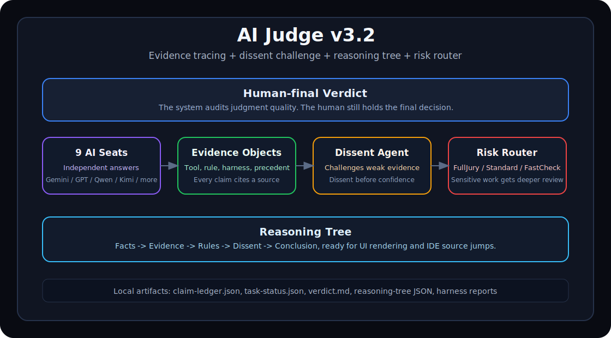
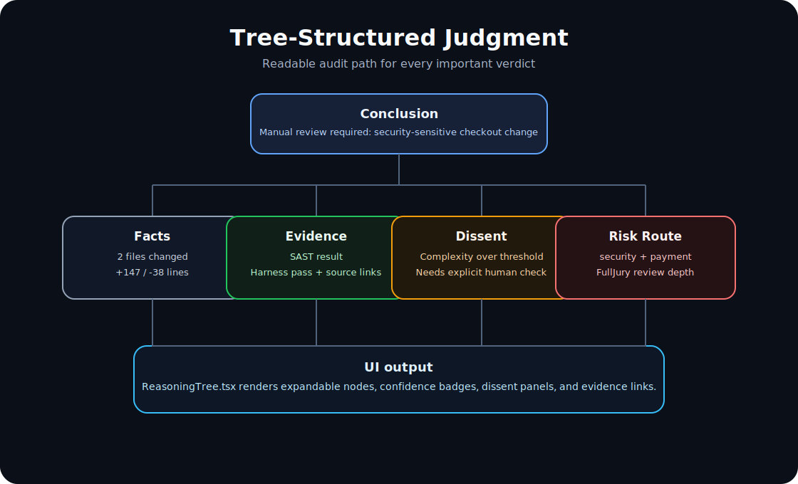

# AI Judge v3.2.0 — Release Notes



## Overview

v3.2.0 upgrades AI Judge from scoring-and-feedback into an auditable judgment architecture. It integrates four Tianfu Agent-inspired patterns into AI Judge's local-first Texas Council model: structured evidence objects, a dissent challenge agent, tree-structured reasoning traces, and risk-based review routing.

The release is additive. Existing v2 scoring, v3.1 neuro-cognitive profiling, Hard Truth Mode, harness tests, and open-core boundaries remain intact.

## New in v3.2.0

### `core/evidence.py` — Structured Evidence Objects

- `Evidence` supports `tool_result`, `rule_match`, `harness_result`, and `precedent`.
- `EvidenceBundle` calculates verifiable ratio, average confidence, evidence strength, evidence quality, and harness conflicts.
- Every important claim can cite a concrete source instead of relying on fluent model text.

### `core/dissent.py` — Devil's Advocate Agent

- Challenges weak evidence chains, single-source support, low-confidence findings, subjective claims, and untested security assertions.
- Uses a restricted view inspired by asymmetric review: AST, lint, SAST, and diff size can trigger dissent without reading business intent.
- Produces required follow-up checks before confidence is raised.

### `core/reasoning_trace.py` — Reasoning Tree Builder

- Builds a 5-layer JSON tree: Facts -> Evidence -> Rules -> Dissent -> Conclusion.
- Mirrors the TypeScript UI data structure used by `frontend/src/components/ReasoningTree.tsx`.
- Supports source links for IDE jumps and expandable reasoning nodes.

### `core/risk_router.py` — Risk Classification Router

- Routes work to `FullJury`, `StandardWithDissent`, `Standard`, or `FastCheck`.
- Security, payment, auth, privacy, credentials, data, and compliance surfaces trigger deeper review.
- Hard Truth L2+ can force dissent even when the task itself is otherwise ordinary.

## Updated Modules

- `core/scoring_v2.py`: adds `score_jury_full_pipeline_v3_2()`.
- `core/determinism.py`: adds `compute_confidence_with_evidence()`.
- `core/__init__.py`: bumps package metadata to `3.2.0`.
- `cli/main.py`: adds `v3.2-pipeline --demo`.

## New Product Assets



- `frontend/`: TypeScript UI components for reasoning tree, confidence badge, dissent panel, and evidence links.
- `rust-engine/`: Rust reference implementation for engine and council concepts.
- `docs/v3.2-source/`: source design discussion, technical spec, and final upgrade roadmap from the full product package.

## Quick Demo

```bash
python3 cli/main.py v3.2-pipeline --demo
PYTHONPATH=. python3 tests/smoke_test_v3_2.py
```

Expected behavior:

- Security/payment task routes to `full_jury`.
- Evidence bundle reports three evidence items.
- Dissent is triggered before final confidence.
- Reasoning tree includes fact, evidence, dissent, and conclusion nodes.

## Migration From v3.1.0

- Existing `run_full_v3_pipeline()` remains unchanged.
- Existing `score_jury_v2()` and `score_jury_full_pipeline()` remain unchanged.
- New integrations should call `score_jury_full_pipeline_v3_2()` when evidence bundles or task risk metadata are available.
- Existing v3.1 demos still work and remain useful for cognitive proxy/Hard Truth behavior.

## Release Package

- Repository target: `https://github.com/reguorider-gif/ai-judge`
- Source packages used for this update:
  - `core/ai-judge-v3.2.0.tar.gz`
  - `core/ai-judge-v3.2.0-full.tar.gz`
