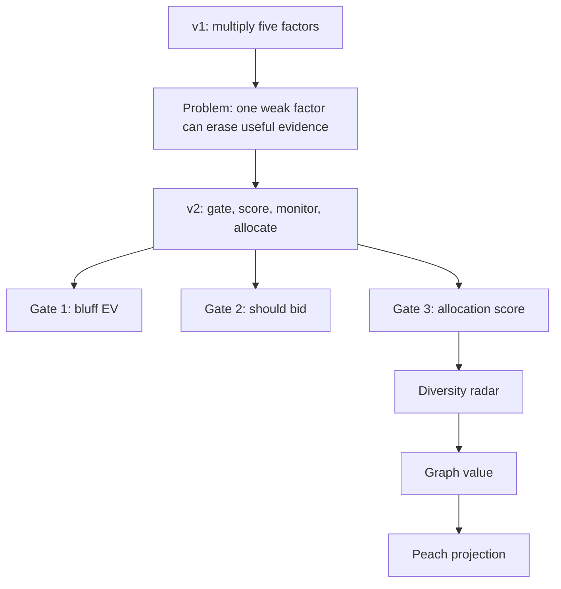

# AI Judge v2 Scoring Engine

This release publishes the v2 scoring engine: a 10-function, auditable pipeline for claim scoring, bluff detection, consensus-health checks, graph valuation, and scarcity-based influence allocation.

Package release: `v2.1.0`
Scoring engine: `v2.0`

## What Changed



## New Core Modules

| File | Role |
|---|---|
| `core/formula_engine.py` | 10 standalone scoring and audit functions |
| `core/scoring_v2.py` | Three-gate claim scoring and full demo pipeline |
| `core/consensus_v2.py` | Diversity index, cluster detection, graph valuation |
| `core/peach_projection.py` | Top-k scarcity allocation for seat influence |
| `cli/main.py` | Adds `ai-judge score-v2 --demo` |

## The 10 Functions

| # | Function | What it does |
|---:|---|---|
| 1 | `log_score` | Continuous probability penalty. A confident miss costs much more than an uncertain miss. |
| 2 | `allocation_score` | Weighted-sum claim scoring that preserves nuance instead of multiplying everything down. |
| 3 | `evaluate_bluff_ev` | Blocks or flags high-confidence, low-evidence claims. |
| 4 | `should_bid` | Allows a model/seat to abstain without punishment when it is not qualified. |
| 5 | `brier_score` | Measures calibration error with squared loss. |
| 6 | `calculate_voi` | Computes whether a tool call or extra information was worth its cost. |
| 7 | `half_kelly_cap` | Caps risk exposure based on probability, odds, bankroll, and sample size. |
| 8 | `cheat_ev` | Detects when manipulation has positive expected value. |
| 9 | `graph_value_v2` | Values seats by correctness first; rarity only counts after calibration passes. |
| 10 | `auc_score` | Measures ranking quality for true vs false claims. |

## Demo Output Snapshot

Command:

```bash
ai-judge score-v2 --demo
```

Observed on the built-in fixture:

| Metric | Value |
|---|---:|
| Claims | 5 |
| Credible | 3 |
| Rejected | 2 |
| Bluff-blocked | 2 |
| Average score | 0.4952 |
| Diversity index | 0.008405 |
| Diversity health | critical |
| Top graph-value seat | DeepSeek |
| Peach winners | DeepSeek, Gemini |

## Migration

```python
# v1 style
score = source_authority * evidence_strength * freshness * reproducibility * reliability

# v2 style
from core.scoring_v2 import score_claim_v2

result = score_claim_v2(
    claim="Currency risk is higher than projected",
    source_authority=0.90,
    evidence_strength=0.85,
    evidence_count=4,
    evidence_quality=0.92,
    freshness=0.95,
    reproducibility=0.88,
    historical_reliability=0.85,
    confidence=0.78,
    known_outcome=True,
)
```

The result includes `bluff_gate`, `bid_gate`, `score`, `tier`, component weights, optional `log_score`, and explanatory text.

## Comparison Notes

- Compared with [Hermes skills](https://hermes-agent.ai/blog/hermes-agent-skills-guide), AI Judge is not just a package envelope; it includes a scoring engine and verdict workflow.
- Compared with [llm-council](https://llm-council.dev/), AI Judge does not delegate final authority to a chairman LLM.
- Compared with [Perplexity Model Council](https://www.perplexity.ai/help-center/zh-CN/articles/13641704-%E4%BB%80%E4%B9%88%E6%98%AF-model-council), AI Judge exposes formulas and runs as a local-first CLI/Codex skill rather than a closed web-only synthesizer.

## Verification

Recommended pre-release checks:

```bash
python3 -m py_compile cli/main.py core/*.py
python3 cli/main.py score-v2 --demo
python3 -m pip install --dry-run -e .
```

AI Judge v2 scoring engine keeps the machine useful and the judgment human.
