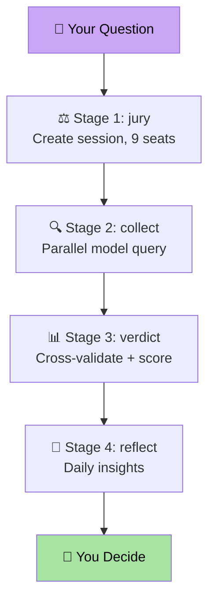
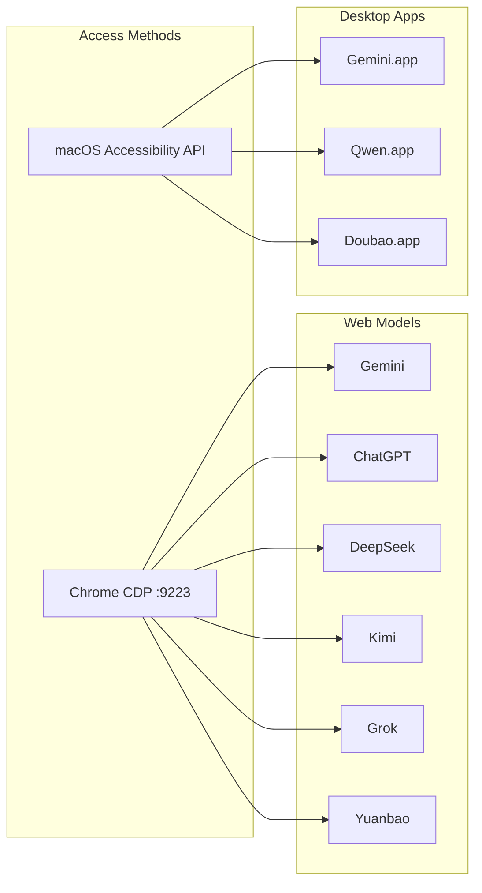
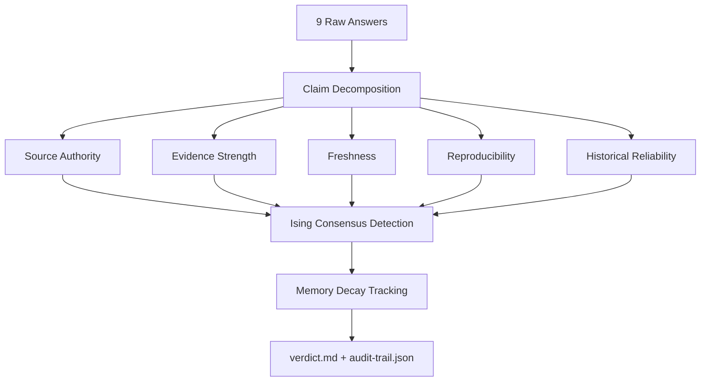

# AI Judge Architecture

## System Overview



## Model Access Layer



## Cross-Validation Engine



## Data Flow

```
~/.ai-judge/runs/YYYY-MM-DD-NNN/
├── task-status.json       # Session metadata
├── answers.md             # 9 raw model answers
├── claim-ledger.json      # Claim decomposition + 5-dim scores
├── verdict.md             # Human-readable verdict
├── feature-ledger.json    # Seat performance trends
├── audit-trail.json       # Full traceability chain
└── hermes-output.json     # Hermes delivery envelope
```

## Technology Stack

| Layer | Technology |
|-------|-----------|
| CLI | Python 3.11+ (argparse) |
| Web Automation | Chrome DevTools Protocol |
| Desktop Automation | Swift + macOS Accessibility API |
| Data Format | JSON, Markdown |
| Packaging | pip, Docker |
| CI/CD | GitHub Actions |
