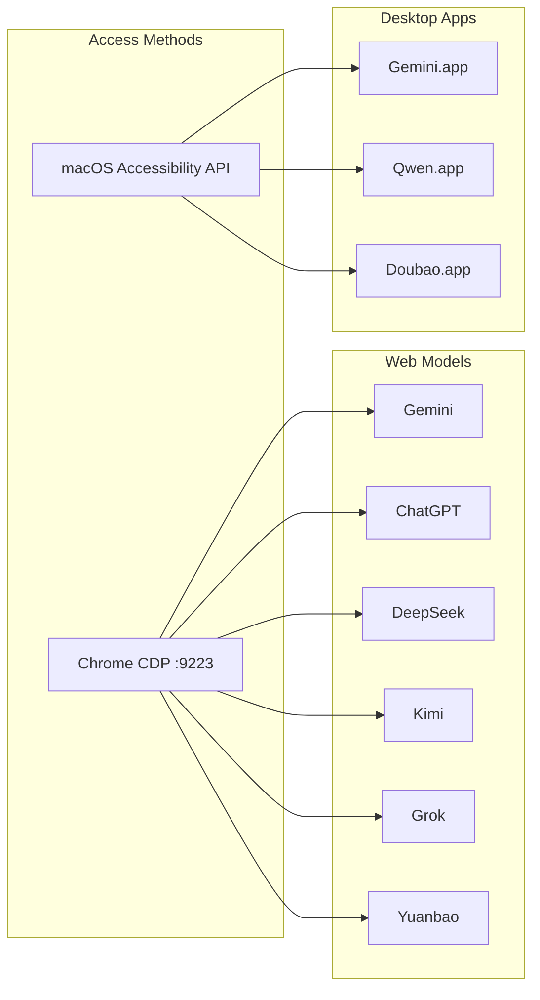
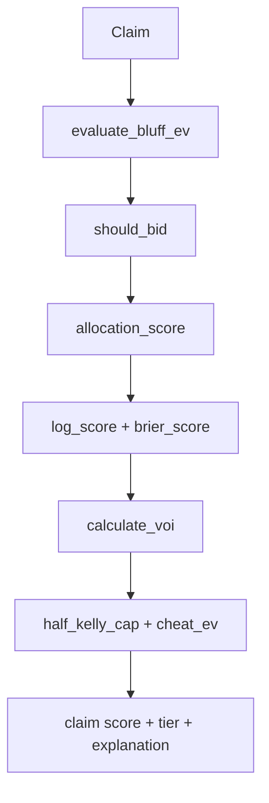

# AI Judge v2 Architecture

## System Overview

```mermaid
flowchart LR
    Q["User question"] --> S["9 independent seats"]
    S --> L["Claim ledger"]
    L --> G1["Gate 1: bluff EV"]
    G1 --> G2["Gate 2: should bid"]
    G2 --> G3["Gate 3: allocation score"]
    G3 --> D["Diversity radar"]
    D --> V["Graph value"]
    V --> P["Peach projection"]
    P --> H["Human verdict"]
```



## Model Access Layer



## v2 Scoring Engine



The public engine lives in `core/formula_engine.py` and `core/scoring_v2.py`. It is intentionally small enough to audit.

## Consensus Layer

`core/consensus_v2.py` estimates diversity health, clusters similar seats, and computes `graph_value_v2`. `core/peach_projection.py` then allocates primary weight to the top seats while keeping a floor for minority signals.

## Data Flow

```
~/.ai-judge/runs/YYYY-MM-DD-NNN/
├── task-status.json       # Session metadata
├── answers.md             # 9 raw model answers
├── claim-ledger.json      # Claim decomposition + v2 score components
├── verdict.md             # Human-readable verdict
├── feature-ledger.json    # Seat performance trends
├── audit-trail.json       # Full traceability chain
└── hermes-output.json     # Hermes delivery envelope
```

## Technology Stack

| Layer | Technology |
|-------|-----------|
| CLI | Python 3.11+ (argparse) |
| Web Automation | Chrome DevTools Protocol |
| Desktop Automation | Swift + macOS Accessibility API |
| Data Format | JSON, Markdown |
| Packaging | pip, Docker |
| CI/CD | GitHub Actions |
