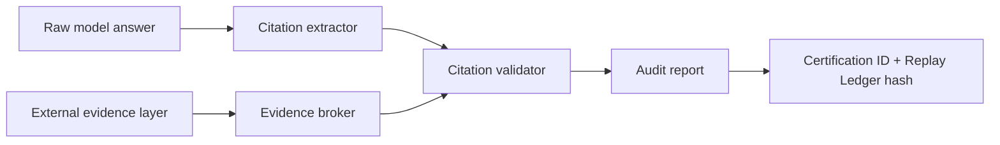

# Paper Seed: Source-Isolated Citation Audit

Working title:

```text
Source-Isolated Citation Audit for LLM Outputs in Specialized Domains
```

Target:

```text
Eval4SD 2026 short or position paper
```

## Abstract Draft

Large language models increasingly produce reports, legal memos, research summaries, and other source-heavy artifacts. Existing evaluation often collapses several questions into one: whether a citation exists, whether the source is relevant, whether the cited claim is supported, and whether the evidence has trustworthy provenance. This paper proposes a source-isolated citation audit protocol for LLM outputs. The protocol keeps the raw model answer, external evidence, and audit verdict as separate layers, preventing model-mentioned sources from verifying themselves. It labels citations as `verified`, `weakly_verified`, `irrelevant`, `unverifiable`, or `contradicted`, while adding reason codes for unverifiable cases and provenance grades for evidence. We present AI Judge Citation Audit, a local-first implementation that emits a Certification ID, Replay Ledger hash, HTML/JSON reports, and deterministic benchmark results. We argue that citation-level audit is a useful MVP but insufficient for legal and high-stakes workflows; the next audit atom should be `claim-span + source`, so a real source can be distinguished from a supported claim.

## Research Question

How can LLM-generated citations be audited without allowing the model's own source claims to become self-verifying evidence?

## Contributions

1. A source-isolation protocol: raw answer, external evidence, and audit verdict remain separate.
2. A citation label taxonomy for publication risk.
3. `unverifiable` reason codes that distinguish missing evidence from fetch failures, blocked retrieval, weak matches, unfetched model candidates, and no-citation cases.
4. Evidence provenance grades: model candidate, user supplied, fetched, independently attested, notarized.
5. A deterministic benchmark with hard cases, including a real-source / overclaimed-causation case.
6. A roadmap from citation-level verdicts to `claim-span + source` scoring.

## Method Sketch



The key rule is simple: a source mentioned by the model is only a candidate. It can become validating evidence only when it enters a separate evidence layer through user supply, network fetch, independent attestation, or notarization.

## Benchmark Story

The hard benchmark should include at least five failure families:

| Family | Example |
|---|---|
| Fabricated source | The model cites a plausible report that does not exist in supplied/fetched evidence. |
| Real but irrelevant source | The URL exists, but the content does not support the answer. |
| Contradicted source | External evidence explicitly refutes the claim. |
| Unverifiable access state | Source may exist but is paywalled, blocked, unavailable, or not fetched. |
| Real source, overclaimed support | Source reports correlation; model claims causation. |

## Position

Citation-level audit is a practical first product boundary. It is not the final research boundary. In legal, policy, medical, or financial workflows, a single citation can support one clause, be silent on another, and refute a third. The full system therefore needs claim-span extraction and source-specific support labels.

## Limitations

- The current implementation uses deterministic matching and explicit evidence objects; it does not prove factual truth.
- User-supplied evidence is useful but not equivalent to independently attested or notarized evidence.
- Citation-level labels can hide compound-claim failures.
- Network fetching introduces access, paywall, and reproducibility constraints.

## Experiments To Add

1. Run the default 100-case benchmark.
2. Run the hard benchmark and report per-category accuracy.
3. Add a small legal memo case where one citation supports, omits, and contradicts different clauses.
4. Compare output with LegalCiteBench categories if mapping permission or collaboration is available.
5. Compare scientific-paper citation handling with HalluCiteChecker if taxonomy exchange succeeds.
