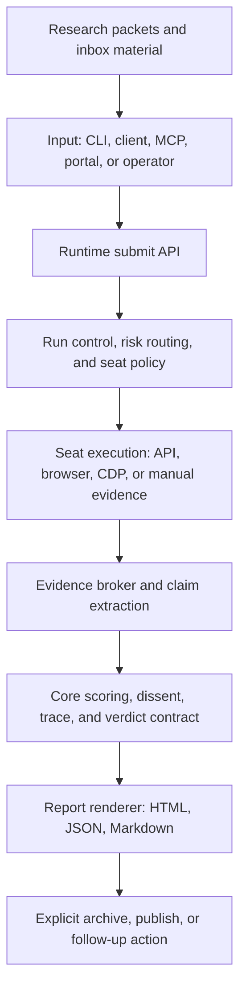

# AI Judge Structural Governance

This note protects the AI Judge core while the surrounding workflow keeps adding
runtime, browser, reporting, portal, and research capabilities. The goal is not
to slow product learning down. The goal is to keep every new capability in the
right lane until it proves it belongs closer to the core.

## Current Operating Verdict

AI Judge should stay additive, but not porous.

- The stable product surface is the final auditable report: claims, evidence,
  dissent, trace, verdict, and human-final handoff.
- The core should remain small, schema-driven, and free of browser, portal,
  workspace, or research-packet assumptions.
- Browser seats, local runtime orchestration, portals, inbox research packets,
  and one-off report tooling are useful, but they are not automatically core
  product logic.
- New capabilities start as sidecars or adapters. They move inward only after a
  promotion review proves their contract, failure mode, and rollback path.

## Canonical Flow

The flow above is the default path. A feature that cannot name where it fits in
this path is not ready to be promoted.

## Structural Lanes

| Lane | Belongs here | Must not do |
|---|---|---|
| Core contract | Claim schema, evidence schema, verdict schema, scoring primitives, trace objects | Import browser state, portal routes, raw run folders, or research packet paths |
| Runtime orchestration | Run lifecycle, seat policy, risk routing, task status, local API | Change core scoring semantics without a versioned contract |
| Bridges and adapters | Chrome CDP, fixed tabs, API providers, web seats, desktop wrappers | Hide partial failures or mutate run state during passive status checks |
| Reports and portal | Report rendering, dashboard views, operator UX, archive views | Become the source of truth for verdict logic |
| Ops and experiments | One-off scripts, demos, migrations, recovery tools, local probes | Become mandatory production flow without promotion review |
| Research packets | Upstream evidence gathering, demand research, candidate pools, source packs | Directly change scoring weights, verdict labels, or seat policy |

## Stable Core Rules

1. Core accepts normalized inputs and emits versioned outputs.
2. Core cannot depend on local browser sessions, cookies, tabs, portal state, or
   file locations outside its declared input bundle.
3. Core cannot read inbox research packets directly. Research packets must be
   summarized into explicit evidence inputs first.
4. Core changes require schema/version notes, focused tests, and a migration
   note when output shape changes.
5. If a change only improves collection, rendering, archiving, or operator
   ergonomics, keep it outside core.

## Side-Effect Levels

Every endpoint, command, or tool should fit one of these levels:

| Level | Meaning | Examples |
|---|---|---|
| `read_only` | Reads state only. No wake, no run, no write. | health, status, result fetch |
| `wake_only` | May prepare a dependency, but does not start a run. | explicit browser wake |
| `run_mutating` | Starts, resumes, cancels, or retries execution. | submit run, recover seat |
| `archive_mutating` | Writes to vault, local history, or long-term storage. | archive to Obsidian |
| `publish_mutating` | Makes output externally visible. | public report publish, release upload |

Passive polling must stay `read_only`. If a dashboard or MCP status call can
wake Chrome, open tabs, mutate a run, archive, or publish, it is in the wrong
side-effect level.

## Promotion Gate

Before moving any sidecar, demo, or experimental feature into the default AI
Judge flow, answer these questions in the PR or release note:

1. What user workflow does it improve?
2. Which structural lane owns it?
3. What input and output contract does it use?
4. What happens when it fails, times out, or returns partial data?
5. What is the kill switch or fallback path?
6. Which test or smoke command proves the default path still works?
7. Does it touch private data, browser state, local run history, or public
   publishing?
8. What will be deprecated or simplified after this is promoted?

If the answers are not clear, keep the feature experimental.

## Research Packet Boundary

Demand research packets, candidate pools, social/video research, and inbox
material are upstream evidence assets. They can improve the quality of a prompt,
run brief, evidence bundle, or product decision. They should not be imported as
runtime dependencies by core scoring or verdict logic.

Allowed:

- Attach a summarized research packet to a run brief.
- Convert sources into explicit evidence objects.
- Use research packets to choose what to test next.

Not allowed:

- Read a research-packet directory from core scoring code.
- Change verdict labels because a packet exists.
- Treat candidate discovery as proof without evidence normalization.

## Maintenance Targets

- Keep the core contract boring and small.
- Split large runtime, portal, and report files when they are touched for real
  work. Do not do a cosmetic mega-refactor just to move lines around.
- Prefer narrow adapters over new global switches.
- Retire demos, experiments, and generated reports when they no longer support
  an active workflow.
- Reduce type-check or lint exemptions gradually when editing the affected
  module.
- Stage release and GitHub changes by explicit path. Do not use broad `git add`
  in a mixed worktree.

## Quick Decision Test

Ask this before adding anything:

- Does it change how AI Judge judges? Then it needs a core contract review.
- Does it collect more or better inputs? Put it in bridges, adapters, or
  research packets.
- Does it display or package outputs? Put it in reports or portal.
- Does it repair, migrate, or operate the system? Put it in ops.
- Does it need browser/login state? It is not core.

This keeps the system extensible without turning the default run path into a
pile of hidden dependencies.
